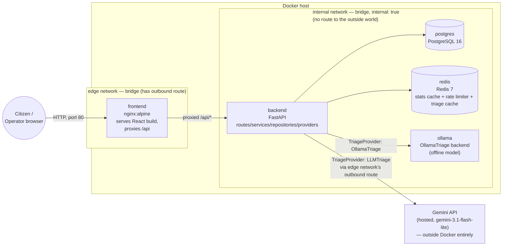
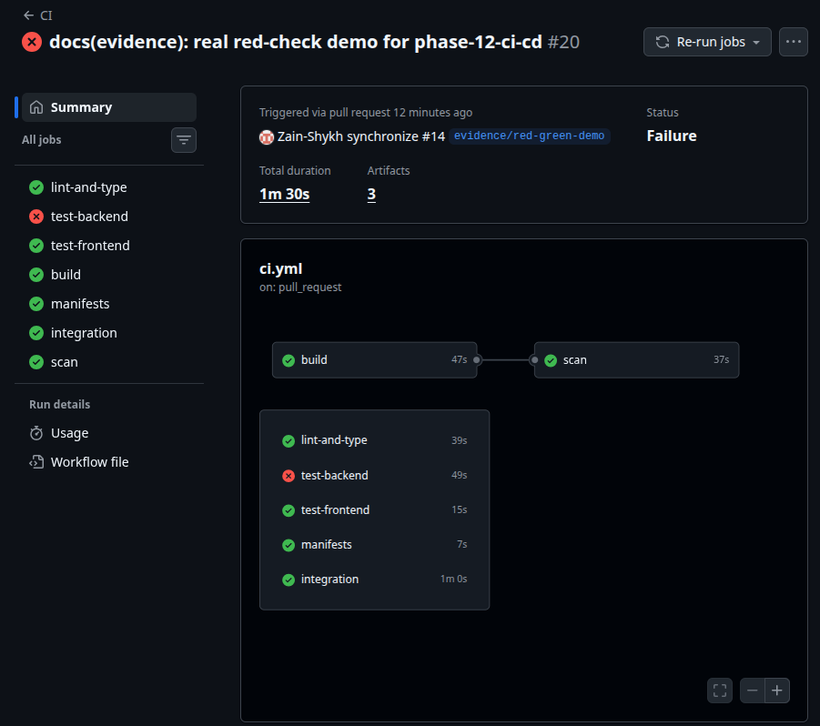
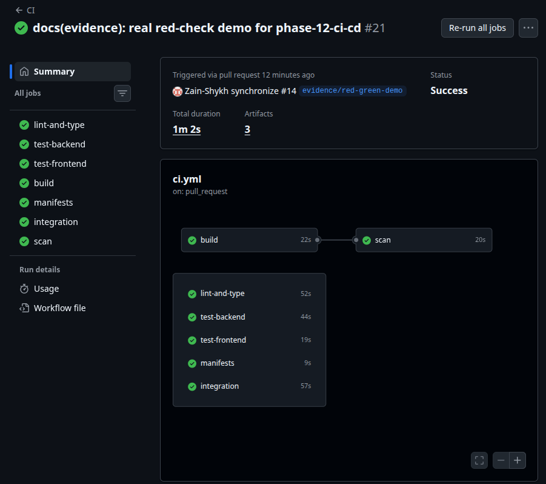

# CivicPulse

[](https://github.com/Zain-Shykh/Civic-Pulse/actions/workflows/ci.yml)
[](https://github.com/Zain-Shykh/Civic-Pulse/actions/workflows/cd.yml)
[](https://github.com/Zain-Shykh/Civic-Pulse/actions/workflows/release.yml)

Municipal complaint intake, triage and operations platform — CS4032 Assignment 1 ("Software Construction and Design").

## Problem statement

A citizen reports a civic issue — a burst water main, a dead streetlight, an open manhole — as free text through a web form. Every municipal team that has ever run a complaints inbox knows what happens next without automation: complaints pile up untriaged, urgent ones (a live electrical hazard) sit next to routine ones (a billing dispute) with no way to tell them apart at a glance, and nobody has a live picture of what's open, what's overdue, or what the system is actually doing under load.

CivicPulse automates the triage step — an AI layer classifies each complaint into a category, priority and one-line summary — persists every complaint durably, and gives operators a live dashboard backed by cached aggregate stats. It runs as five cooperating containers locally via Docker Compose, and as a probed, autoscaling workload on Kubernetes in CI/CD.

## Architecture



`backend` is the only service on both networks — it's what lets the LLM call reach the public internet while Postgres/Redis/Ollama stay fully unreachable from outside, and the frontend stays fully unable to reach the database. Full detail (why, not just what) is in `docs/architecture/ARCHITECTURE.md`; the diagram above is the same one, not a second independently-drawn version.

## Quickstart

```
git clone https://github.com/Zain-Shykh/Civic-Pulse.git
cd Civic-Pulse
cp .env.example .env
docker compose up
```

Then open `http://localhost:8080`. The default `.env.example` values (`TRIAGE_PROVIDER=rules`) need no API key and no further editing — triage runs against the deterministic keyword-based provider out of the box. To use the real Gemini-backed provider instead, set `TRIAGE_PROVIDER=llm` and a real `GEMINI_API_KEY` in `.env`.

**Verified 2026-09-28** by cloning the real GitHub remote into a fresh directory and running exactly the four commands above, real output pasted in `docs/specs/phase-13-documentation-closeout.md`'s As-Built. **Caveat, stated plainly rather than glossed over:** this machine's Docker daemon already has the base images (`python:3.12-slim`, `node:22-alpine`, `nginx:1.31-alpine`, `postgres:16-alpine`, `redis:7-alpine`) cached from earlier work, so this does not prove a first-ever pull on a machine with a completely empty image cache — only that the compose file, `.env.example`, and these four commands are internally consistent and complete on their own.

## API

Nine endpoints (`docs/CONTRACTS.md` §2.2 — the rubric's own text says "ten," confirmed a typo, nine is authoritative):

| Method | Path | Behaviour |
|---|---|---|
| POST | /api/complaints | Validate → triage → persist. 201. 400 with a field-level error body. 429 when the caller exceeds the rate limit. |
| GET | /api/complaints/{id} | 200 / 404 |
| GET | /api/complaints | Filter by category, priority, status; paginate (page, page_size ≤ 100); return total. |
| PATCH | /api/complaints/{id}/status | Enforce the state machine. Invalid transition → 409 naming the attempted transition. |
| GET | /api/stats | Aggregates, Redis-cached, TTL 30 s, `X-Cache: HIT\|MISS`. |
| GET | /api/meta/providers | Which triage provider is active, and the last 20 triage outcomes (provider, latency ms, fallback y/n). This is your observability surface. |
| GET | /health | Liveness. Process is alive. Must not touch the database. |
| GET | /ready | Readiness. 200 only if Postgres and Redis are both reachable; 503 naming the failed dependency. |
| GET | /metrics | Prometheus text format: request count, request latency histogram, triage latency, fallback counter. |

## Screenshots

CI/CD evidence (`docs/evidence/`):

| A red pipeline blocking a merge | Green, merge-ready |
|---|---|
|  |  |

**Frontend screenshots (Submit / Dashboard / Stats) — disclosed gap, not silently omitted:** not yet captured. No browser/screenshot tool is available in this working session (same limitation named in `docs/specs/phase-12-ci-cd.md` and `docs/specs/phase-13-documentation-closeout.md`'s Open Question 2). To be added in a real follow-up commit once captured manually, the same pattern Phase 12's CI screenshots followed (PR #15).

## Documentation map

- `docs/CONTRACTS.md` — the tested API/schema/behaviour contracts.
- `docs/architecture/ARCHITECTURE.md` — full system architecture and the network-segmentation/LLM-egress reasoning.
- `docs/TRIAGE.md` — the AI triage layer: provider interface, the three real implementations, retry/fallback/redaction.
- `docs/RUNBOOK.md` — deploy, roll back, read logs, diagnose a failing triage provider.
- `docs/ENGINEERING-NOTES.md` — the assignment's eight required engineering questions, answered with real file:line citations.
- `docs/AI-USAGE.md` — AI-assistance disclosure (assignment §5.5).
- `docs/adr/` — architecture decision records.
- `docs/RUBRIC-CHECKLIST.md` — line-by-line rubric self-assessment against real evidence.
- `docs/IMPLEMENTATION-PLAN.md` — phase-by-phase build order and dependency reasoning.
- `docs/specs/` — every phase's spec → plan → as-built, in full.

## Tech stack

React 18 + Vite + TypeScript (frontend) · FastAPI + Pydantic v2 (backend) · PostgreSQL 16 + Alembic · Redis 7 · Google Gemini (`gemini-3.1-flash-lite`) behind a pluggable `TriageProvider` interface · Docker Compose (local) · Kubernetes via Kustomize, k3d (local) / kind (CI) · GitHub Actions (`ci.yml` / `cd.yml` / `release.yml`) publishing to GHCR with an SBOM.
