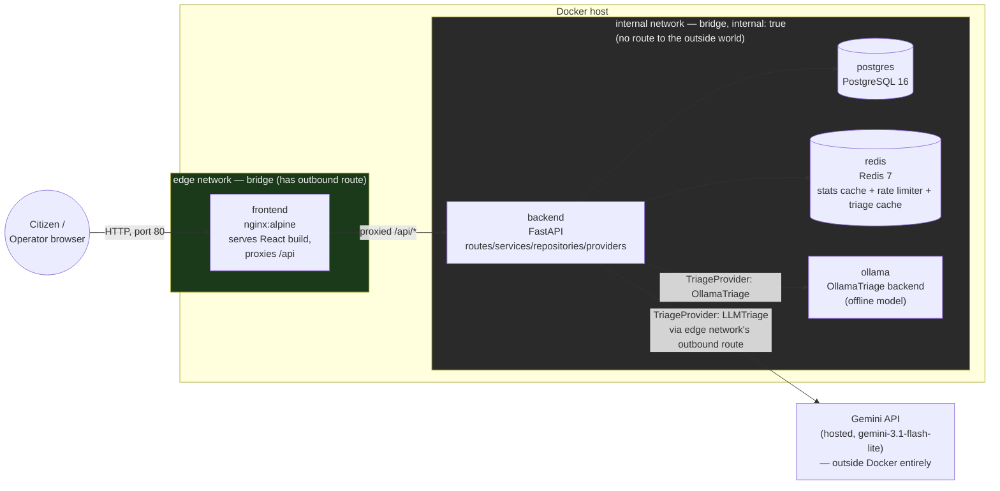

# System Architecture

Source of truth for structure is `docs/CONTRACTS.md`; this document explains how the pieces are placed and why, not what each contract says.

## Component diagram

`backend` is drawn straddling both networks because it is a member of both — per §3.2, "backend joins both — it is the only service that bridges them." Postgres, Redis, and Ollama sit on `internal` only. Frontend sits on `edge` only, so `docker compose exec frontend ping database` fails by construction, satisfying the network-segmentation requirement (§3.2, and the −8 automatic deduction if violated).

## The LLM-egress trade-off (§3.2, §5.2 Q7)

`internal: true` means the `internal` network has no route to the outside world. Every service that sits *only* on `internal` — Postgres, Redis, Ollama — cannot reach the internet, by design; they don't need to.

`LLMTriage` calls the hosted Gemini API, which is on the public internet. **The backend is the component that makes this call**, and it can, because the backend is not confined to the `internal` network — it also has an interface on `edge`, a plain (non-`internal`) bridge network, which retains a normal outbound route via the Docker host's NAT. The backend's membership in `edge` (needed anyway, to receive proxied requests from the frontend) is what gives it a path to Gemini; its membership in `internal` is what lets it reach Postgres, Redis, and Ollama. No component other than the backend needs, or gets, a route out.

This is deliberate, not incidental: if `LLMTriage`'s outbound call had to go through a component confined to `internal`, either the network topology would need a third network (unjustified extra complexity for this system's size) or `internal: true` would have to be dropped (which forfeits the segmentation guarantee and its marks). Keeping the LLM call inside the same process that already has to be edge-facing (to serve the API) means the trade-off costs nothing extra.

## Where OllamaTriage fits

`OllamaTriage` talks to a local Ollama server running its model weights entirely offline — no API key, no internet, no rate limit (per `docs/CONTRACTS.md`, AI layer). Unlike Gemini, it has no outbound-internet requirement at runtime, so it belongs on `internal` alongside Postgres and Redis, not on `edge`. The backend reaches it the same way it reaches Postgres/Redis: over the internal network, via the `TriageProvider` interface, indistinguishable at the call site from any other provider.

One caveat worth naming, not solving here: pulling Ollama's model weights the *first* time needs internet access (§3.2, `ollama_models` volume note — "so you do not re-pull 800 MB on every up"). That's a one-time setup/build-time concern, not a runtime one, and doesn't change where the container sits at steady state; it's implementation detail for the Docker/Compose phase, not an architectural decision.

## Frontend runtime configuration

Decided in `docs/adr/0002-frontend-runtime-config.md` — referenced here, not re-decided: the frontend never holds an absolute backend URL. See that ADR for the mechanism and the alternative considered.
