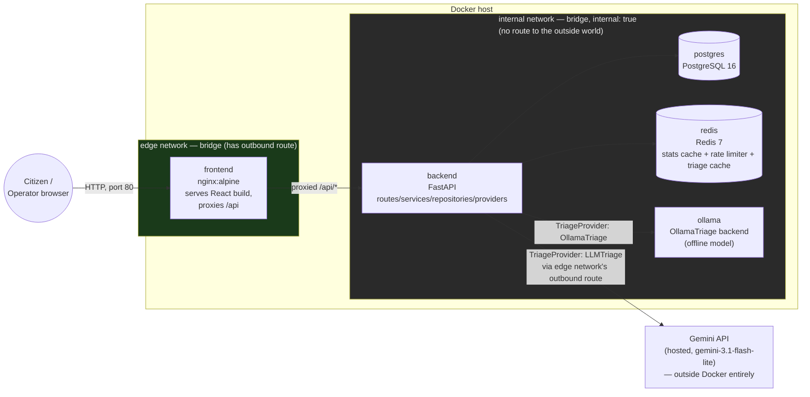

# System Architecture

Source of truth for structure is `docs/CONTRACTS.md`; this document explains how the pieces are placed and why, not what each contract says.

## Component diagram

```mermaid
graph LR
    citizen((Citizen /<br/>Operator browser))

    subgraph docker["Docker host"]
        subgraph edgeNet["edge network — bridge (has outbound route)"]
            frontend["frontend<br/>nginx:alpine<br/>serves React build,<br/>proxies /api"]
        end

        subgraph internalNet["internal network — bridge, internal: true<br/>(no route to the outside world)"]
            backend["backend<br/>FastAPI<br/>routes/services/repositories/providers"]
            postgres[("postgres<br/>PostgreSQL 16")]
            redis[("redis<br/>Redis 7<br/>stats cache + rate limiter + triage cache")]
            ollama["ollama<br/>OllamaTriage backend<br/>(offline model)"]
        end
    end

    gemini["Gemini API<br/>(hosted, gemini-3.1-flash-lite)<br/>— outside Docker entirely"]

    citizen -->|HTTP, port 80| frontend
    frontend -->|proxied /api/*| backend
    backend --> postgres
    backend --> redis
    backend -->|TriageProvider: OllamaTriage| ollama
    backend -->|TriageProvider: LLMTriage<br/>via edge network's outbound route| gemini

    style internalNet fill:#2a2a2a,color:#eee
    style edgeNet fill:#1a3a1a,color:#eee
```

`backend` is drawn straddling both networks because it is the only service that bridges them — per §3.2, "backend joins both." Postgres, Redis, and Ollama (both the long-running server and the one-shot puller — see below) sit on `internal`/`edge` respectively, never both. Frontend sits on `edge` only, so `docker compose exec frontend ping database` fails by construction, satisfying the network-segmentation requirement (§3.2, and the −8 automatic deduction if violated).

## The LLM-egress trade-off (§3.2, §5.2 Q7)

`internal: true` means the `internal` network has no route to the outside world. Every service that sits *only* on `internal` — Postgres, Redis, Ollama — cannot reach the internet, by design; they don't need to.

`LLMTriage` calls the hosted Gemini API, which is on the public internet. **The backend is the component that makes this call**, and it can, because the backend is not confined to the `internal` network — it also has an interface on `edge`, a plain (non-`internal`) bridge network, which retains a normal outbound route via the Docker host's NAT. The backend's membership in `edge` (needed anyway, to receive proxied requests from the frontend) is what gives it a path to Gemini; its membership in `internal` is what lets it reach Postgres, Redis, and Ollama. No component other than the backend needs, or gets, a route out.

This is deliberate, not incidental: if `LLMTriage`'s outbound call had to go through a component confined to `internal`, either the network topology would need a third network (unjustified extra complexity for this system's size) or `internal: true` would have to be dropped (which forfeits the segmentation guarantee and its marks). Keeping the LLM call inside the same process that already has to be edge-facing (to serve the API) means the trade-off costs nothing extra.

## Where OllamaTriage fits

`OllamaTriage` talks to a local Ollama server running its model weights entirely offline — no API key, no internet, no rate limit (per `docs/CONTRACTS.md`, AI layer). Unlike Gemini, it has no outbound-internet requirement at runtime, so it belongs on `internal` alongside Postgres and Redis, not on `edge`. The backend reaches it the same way it reaches Postgres/Redis: over the internal network, via the `TriageProvider` interface, indistinguishable at the call site from any other provider.

Pulling Ollama's model weights (`qwen2.5:0.5b`, ~397 MB) the *first* time needs internet access — resolved in Phase 16 by a separate one-shot `ollama-pull` service. It does not bridge `edge`/`internal` to do this: it runs its own throwaway local `ollama serve` against the same `ollama_models` volume the real `ollama` service reads from, pulls the model directly into it, and exits — so it only ever needs `edge` (for registry egress), never `internal`. This isn't just simpler: a container joining both `edge` and `internal` (`internal: true`) was confirmed, empirically, to make the real `ollama` binary's own Go DNS resolver reliably fail external lookups (`registry.ollama.ai`) — a real Docker/Go interaction, not a flaky network, reproduced repeatedly and isolated down to `internal: true` as the only variable. See `docs/specs/phase-16-ollama-triage-and-fallback-chain.md` and `ollama/pull-model.sh` for the full write-up. Once pulled, cached in the volume so it isn't re-pulled on every `up`.

## Frontend runtime configuration

Decided in `docs/adr/0002-frontend-runtime-config.md` — referenced here, not re-decided: the frontend never holds an absolute backend URL. See that ADR for the mechanism and the alternative considered.
