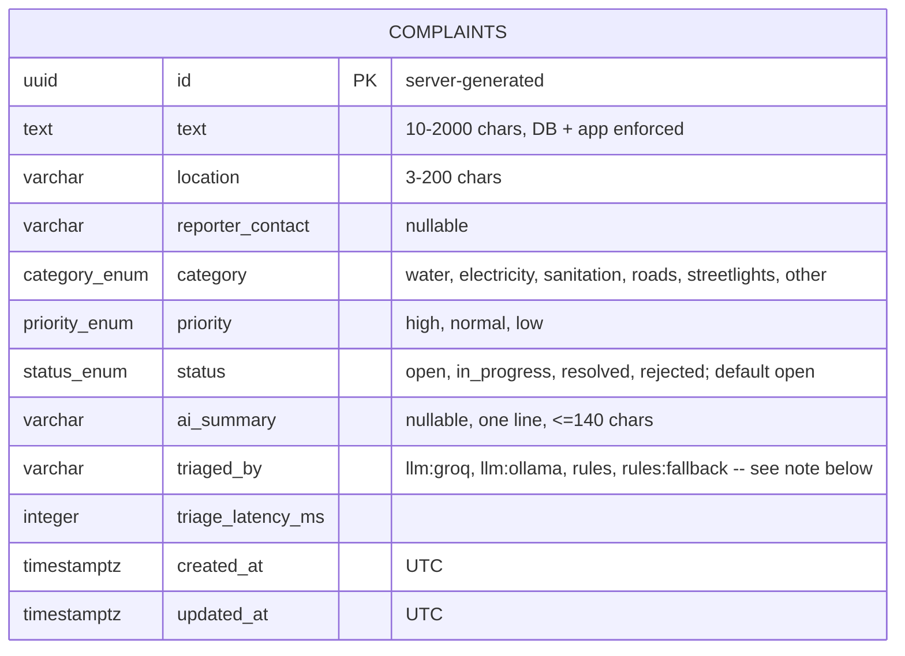

# Database Schema

Matches `docs/CONTRACTS.md`'s schema table (§2.3) exactly — that file is the source of truth for column definitions; this file adds the ERD and the index justification the assignment requires.

## ERD

A single domain entity, per the assignment's minimum schema (§2.3) — no other domain tables are required, and none are added speculatively.



> **Note on `triaged_by` values:** the schema table in §2.3 lists `llm:groq · llm:ollama · rules · rules:fallback` as the value set, but the chosen LLM provider is Gemini, not Groq (`docs/OPEN-DECISIONS.md` #1). Whether the recorded value should literally be `llm:gemini` (following the `llm:<provider>` pattern, but diverging from the spec's listed values) or kept as `llm:groq` regardless of actual provider (matching the spec's literal enum but misdescribing what happened) is flagged as an ambiguity, not decided here — see end-of-phase ambiguity list.

## Indexes

Two required (§2.3): `(status, priority)` and `created_at`. Each is justified below by the exact query it serves, taken from the API contract in `docs/CONTRACTS.md`, not a generic justification.

### `(status, priority)` composite index

Serves `GET /api/complaints` (§2.2) when the operator dashboard filters by status and/or priority — the dashboard's required filter set (§2.1, Dashboard view: "filterable list (category, priority, status)"). The concrete query shape:

```sql
SELECT * FROM complaints
WHERE status = $1 AND priority = $2
ORDER BY created_at DESC
LIMIT $3 OFFSET $4;
```

e.g. an operator viewing "all open, high-priority complaints" — the most operationally common dashboard view, since it's exactly the queue that needs attention first (§1.1's whole motivating scenario: an urgent burst-main report buried in an unsorted queue). A composite index on `(status, priority)` lets Postgres satisfy the `WHERE` clause with an index scan instead of a sequential scan over the full table, and serves single-column queries on `status` alone too (leftmost-prefix rule), which is the more common single filter.

### `created_at` index

Serves the default, unfiltered case of `GET /api/complaints` — pagination ordered by recency when no `status`/`priority`/`category` filter is applied:

```sql
SELECT * FROM complaints
ORDER BY created_at DESC
LIMIT $1 OFFSET $2;
```

Without this index, the default dashboard view (no filters — "show me everything, newest first") forces a full sequential scan plus a sort on every page load. It also backs any future time-bounded query (e.g. "complaints from the last 24 hours"), though none is in the current contract — this index isn't justified by that possibility, only by the default-listing query above.
